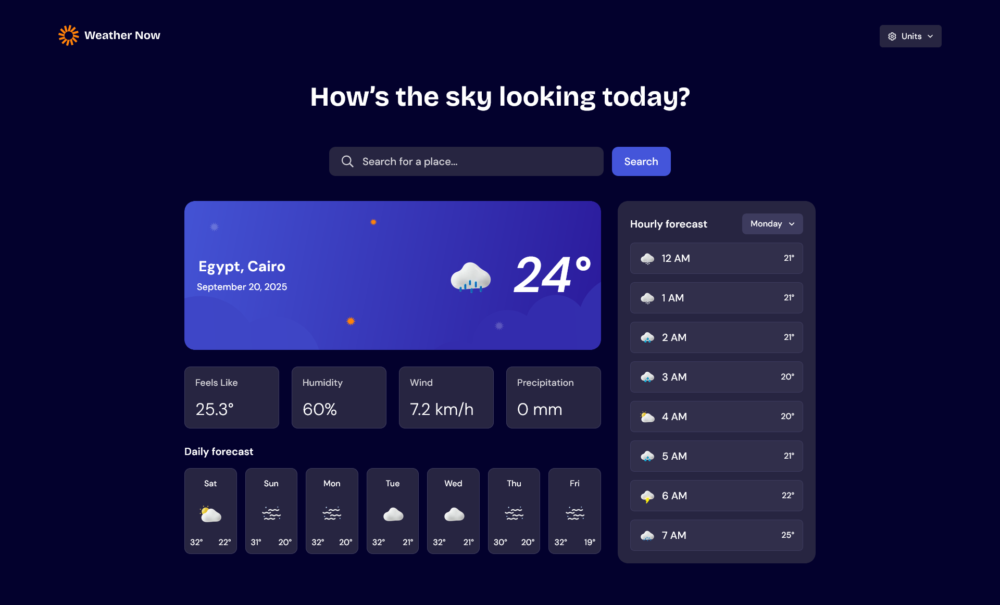

# Frontend Mentor - Weather app solution

This is a solution to the [Weather app challenge on Frontend Mentor](https://www.frontendmentor.io/challenges/weather-app-K1FhddVm49). Frontend Mentor challenges help you improve your coding skills by building realistic projects. 

## Table of contents

- [Overview](#overview)
  - [The challenge](#the-challenge)
  - [Screenshot](#screenshot)
  - [Links](#links)
- [My process](#my-process)
  - [Built with](#built-with)
  - [What I learned](#what-i-learned)
- [Author](#author)
- [Acknowledgments](#acknowledgments)

## Overview

### The challenge

Users should be able to:

- Search for weather information by entering a location in the search bar
- View current weather conditions including temperature, weather icon, and location details
- See additional weather metrics like "feels like" temperature, humidity percentage, wind speed, and precipitation amounts
- Browse a 7-day weather forecast with daily high/low temperatures and weather icons
- View an hourly forecast showing temperature changes throughout the day
- Switch between different days of the week using the day selector in the hourly forecast section
- Toggle between Imperial and Metric measurement units via the units dropdown 
- Switch between specific temperature units (Celsius and Fahrenheit) and measurement units for wind speed (km/h and mph) and precipitation (millimeters) via the units dropdown
- View the optimal layout for the interface depending on their device's screen size
- See hover and focus states for all interactive elements on the page

### Screenshot



### Links

- Solution URL: https://github.com/bdocoder/weather-app
- Live Site URL: https://bdocoder-weather-app.vercel.app

## My process

### Built with

- CSS custom properties
- Flexbox
- CSS Grid
- Mobile-first workflow
- [React](https://reactjs.org) - JS library
- [Vite](https://vite.dev) - Build tool
- [TailwindCSS](https://tailwindcss.com) - For styles

### What I learned

- Formatting dates and times with `Intl.DateTimeFormat`:

```js
// Sat
Intl.DateTimeFormat("en", { weekday: "short" }).format(...)

// Saturday
Intl.DateTimeFormat("en", { weekday: "long" }).format(...)

// 1 AM
Intl.DateTimeFormat("en", { hour: "numeric" }).format(...)

// Tuesday, Aug 5, 2025
Intl.DateTimeFormat("en", { dateStyle: "long" }).format(...)
```

- Resetting and customizing variables in TailwindCSS v4:

```css
@theme {
  /* Removes all variables from intellisense (colors, spacing, etc) */
  --*: initial;

  /* Adds custom breakpoints */
  --breakpoint-tablet: 640px;
  --breakpoint-laptop: 1366px;

  /* Adds a text preset */
  --text-1: 96px;
  --text-1--font-weight: 600;
  --text-1--line-height: 100%;
  --text-1--letter-spacing: -2%;

  /* rest is at src/style.css */
}
```

- Adding custom fonts via CSS

- Styling the scrollbar via `::-webkit-scrollbar` and `::-webkit-scrollbar-thumb`

- Managing API requests via [Tanstack Query](https://tanstack.com/query)

## Author

- Frontend Mentor - [@bdocoder](https://www.frontendmentor.io/profile/bdocoder)
